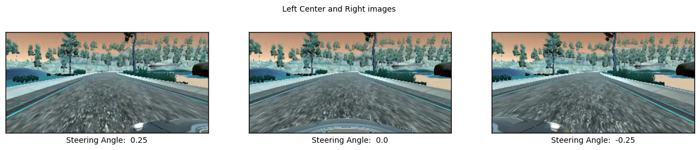
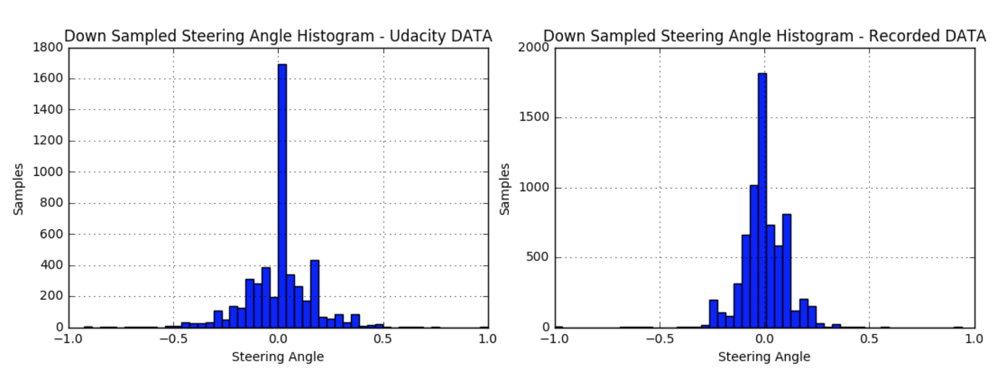
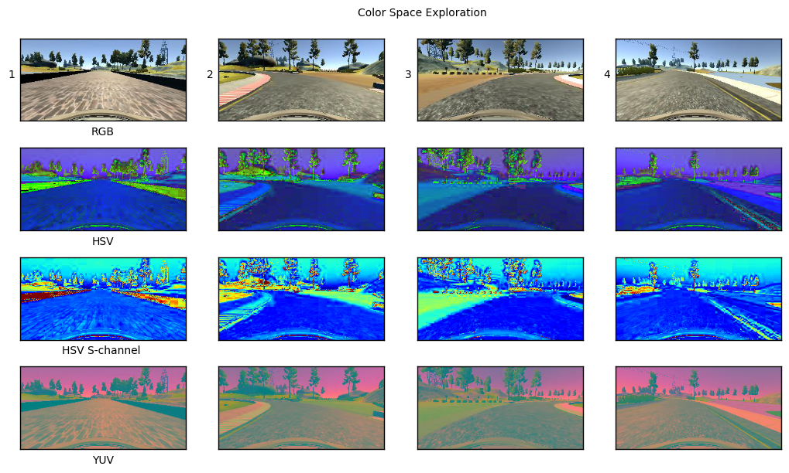
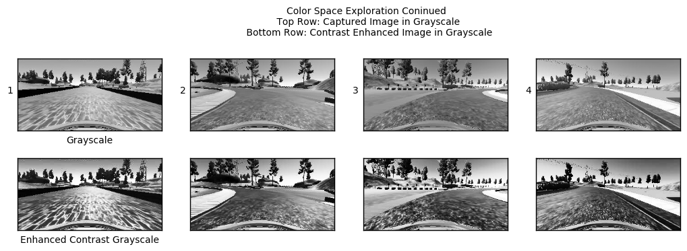
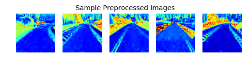

## Behavioral Cloning: An End-to-End Deep Learning Steering System
### Overview
The objective of this project was to develop an End-to-End Deep Learning algorithm to clone human driving behavior similar to the one presented by NVidia paper titled [End-to-End Deep Learning for Self Driving Cars](https://devblogs.nvidia.com/parallelforall/deep-learning-self-driving-cars/). An End-to-End approach only uses a neural network to determine the desired output of a system. 

                        INPUT(Car Center Image) -----> NEURAL NET -------> OUTPUT(Steering Angle)

For this project images from front-facing camera mounted on a car were fed to neural network that predicted the corresponding steering angle of the car. To achieve this, data was collected on a driving simulator that records front camera images and a corresponding steering angle. The camera images were used a training features and steering angles as training labels. The simulator contains two different tracks. Only Track 1 was used to collect training data. After training the neural network, it's performance was validated on Track 1 and the networks's ability to generalize was evaluated on Track 2. The trained network was able to succesfully drive around both tracks without ever leaving the boundaries of the road nor exhibiting 'unsafe' driving behavior.

### Included Files

This project was written in Python using the [KERAS](https://keras.io/) deep learning API. The follwing files were used to create an test the model.

1. `Behavioral Cloning-Oscar Argueta.ipynb`: Used to develop and tune the model. Detailed explanations and figures can be found in this jupyter notebook 
2. `drive.py`: File that loads the neural net model and communicates with the simulator to excecute predicted steering angles
3. `model.py`: File that was used to make and train a KERAS model for a modified version of the LeNet Architecture. Saves model weights 
4. `model.h5`: File that contains the trained weights
5. `model.json`: File contains a JSON representation of the neural net that can be used to predict steering angles in realtime
6. `utils.py`: File contains helper methods to process and batch data

## Data Collection and Preparation

Driving data was collected over 2 separate recording sessions on **TRACK 1**. The keyboard arrow keys were was used to control the car, but unfortunately produced unreliable steering data. The data recorded was comoposed as follows:

**Data Set 1**: 4 laps of centered driving  

**Data Set 2**: 4 laps of centered driving (*oppossite direction*)

Each data set has an associated ``driving_log.csv`` file that contains the recorded center, left, and right images file paths, throttle, steering angle, and speed. In the real word it is not safe and legally practical to simulate the off center lane shifts required to train a car to recuperate from such shift. To simulate such behavior the Left and Right images are used. To train the vehicle to recuperate from these we assign a correction angle, the angle required for the car to recenter on the road, to each left and right image. The correction angle was empirically selected to be 0.25, and the corresponding steering angles are calculated as follows:

                                    left image angle = steering angle + 0.25
                                    right image angle = steering angle - 0.25

              
              
The model was succesfully trained with this data, but given the poor interface for recording (arrow keys), the data set provided by Udacity was used to train the final model as it produced better results. To compare why one data set produces better results a histogram of both data sets were plotted as seen below.

The histogram from the Udacity data more closely resembles a normal distribution in comparison than the recorded data set. It is important to note the data recorded with a zero as steering angle was downsampled to prevent the overwhelming of such samples to bias the model to predict zero

### Color Space Selection

While tuning the architecture, different color spaces were tested by training the model for a fixed number of epochs and then evaluating their performance on the track. The net had a hard time learning to detect the road where boundaries were not present, especially in grayscale. The S-channel in HSV was selected as the input color space for the neural net because the road is clearly discernable even when crossing the bridge and parts with no clear road boundaries and produced the best performance. The different color space comparisons can be seen below.

**Note**: Using the S-channel is possible because the enviroment of the simulator is synthetic and therefore significantly less complex. For real world preception applications the Full HSV or YUV color space are better suited.

### Data Preprocessing

To preprocess the images:

1. **Convert to HSV Color Space and keep S-Channel**
3. **Crop Car Hood and the Horizon**: Samples fed to the net mainly focus on the road.
4. **Resize Image to 64x64**: Since the simulator is much simpler than the real world, reducing the size of the image won't result on loss of important information and will also be less work for the neural net.

Sample preprocessed images are shown below.

**Note**: Normalization will be done within the neural net!

**Note on Augmentation**: Before augmenting the images I decided to train and test with real data only. I determined that the model did not need any augmentation to succesfully drive in the simulator. I considerd flipping the images along the vertical axis to generate twice the data, but did not see any significant gain in performance both in validation loss and actual driving simulations.
    
## Neural Net Architecture
The Neural Net used by NVidia in the paper titled [End-to-End Deep Learning for Self Driving Cars](https://devblogs.nvidia.com/parallelforall/deep-learning-self-driving-cars/) consists of 9 layers, including a normalization layer, 5 convolutional layers, and 3 fully connected layers. Given the difference in complexity between the real world and the simulator, a neural net this large (150k + paramters) and deep is not necessary. In addition, having a much larger network than the application needs means more training time, computational complexity, and the extra risk of overfitting.

For my neural net architecture I decided to scale down to smaller network, the LeNet architecture. An indeed, LeNet can drive. LeNet has 2 convolutional layers and 2 fully connected layers. Before I used this architecture I made a few changes listed below:

1. **Change the size of the image from 32x32 to 64x64**
2. **Added a normalization layer after the input**
3. **Changed the size of the convolution kernels from 5x5 to 3x3**: extract finer features - reducing the number of pixels the filter is sensitive to
4. **Change the activation layers from Relu to ELU(Exponential Linear Units)**: less prone to the vanishing gradient
5. **Changed the size of the pooling kernel from 2x2 to 4x4**: Since I changed the size of the input image to 64x64(double the original size) the spacial reduction during the convolution layers with a 2x2 pooling would have yielded a higher number of parameters to tune. Since the features to be extracted simulator are not very complex, I did not want to add additional convolutional layers. By doubling the size of the pooling I was able to achieve the same spacial reduction without increasing the number of hidden layers nor the number of parameters to tune. It is important to be mindful to the fact that larger the pooling kernel the more information is lost from layer to layer, but it is also a way to prevent overfitting and keep our net size small.

### Architecture - LeNet Drives

#### Input
Accepts a 64x64x1 image as input. S-Channel of HSV color space

----

#### Normalization
Execute image normalization within the neural net. [-0.5, 0.5]

----

**Layer 1: Convolution.** Filter Size: 3x3. Filter Depth: 6. Output shape should be 62x62x6.

**ELU Activation.** 

**4x4 Max-Pooling.** The output shape should be 15x15x6.

----
**Layer 2: Convolution.** Filter Size: 3x3. Filter Depth: 16. Output shape should be 13x13x16.

**ELU Activation.** 

**4x4 Max-Pooling.** The output shape should be 3x3x16.

----
**Flatten.** Flatten the output of each convolution layer after max-pooling

----
**Layer 4: Fully Connected.** 120 outputs.

**ELU Activation.** 

**Layer 5: Fully Connected.** 84 outputs.

**ELU Activation.**

----

### Output
**Predicted Angle.** Steering Angle Value

## Training
To train the model I chose the following parameters:

1. **Learning Rate**: 0.001
2. **Epochs**: 10
3. **Loss Function**: Mean square error - since our ouput is a single numeric value
4. **Batch size**: 128

I refrained from using python generator since the amount of data required to train the network successfuly was small and I did not require data augmentation. I am aware of it's usefulness in memory constraint and real time applications.

I was able to train the network on a modest CPU. Each training epoch took approximately 15 seconds for a **total training time of ~2.5 minutes**. Training the NVidia network for 10 epochs took approximately 25 minutes.

## Results

### Track 1

Click to see video!

### Track 2

Click to see video!

## How to run

1. Install [carnd-term1](https://github.com/udacity/CarND-Term1-Starter-Kit) conda environment
2. Run `pyhton model.py` to train the model and produce `model.h5` and `model.json`
3. Run `python drive.py model.json` to load the neural net model and communicate with the simulator
4. Run the simulator in Autonomous Mode!
